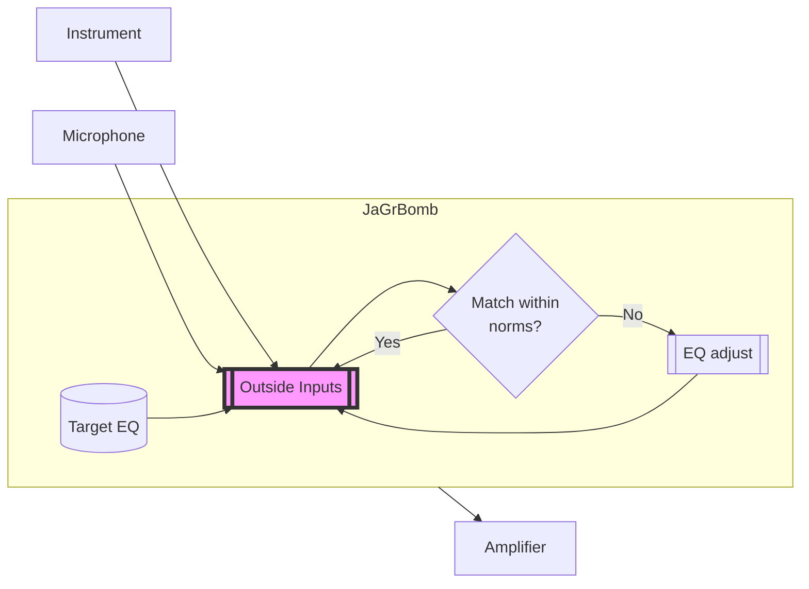

# jagrbomb
AI-powered amp/speaker/mic simulator.

## Setup
The JaGrBomb box takes an instrument signal and acoustic signal as inputs. The acoustic signal is compared against a reference signature, and the instrument output is adjusted in real time to help the acoustic signal more closely match the reference signature.

The instrument can be any line-level source, such as an electric guitar.

The acoustic signal is a reference microphone placed in front of a speaker. It is important that this speaker is also connected to the output of the JaGrBomb box. Otherwise the box will not be able to tell what effect the changes it's making are having.

The reference signature should be a similar instrument (who knows what this thing would do if you played a guitar through a drum signature!) recorded by itself using a reference microphone. The more frequencies that are represented, the better the results will be. The recording is analyzed and saved to the box for use.

## Diagram

## Description
The JaGrBomb is an infinite parametric EQ that self-adjusts to make an instrument sound like a reference signature. A common use is to allow you to record a guitar you own but have it sound like a much more popular guitar.

For example, you would be able to use the JaGrBomb to make your old Cort Stratoblaster single-coiler played through that beat up Peavey solid state amp sound almost exactly like a dual-humbucker Les Paul played through a Marshall tube amp and 4x12 cabinet.

An internal reference signature (e.g. a Les Paul Custom through 4x12 Marshall tube stack) is compared to a microphone signal (perhaps a solid-state Peavey combo amp) in real-time. EQ adjustments are made to the instrument input (a Stratocaster, for example) so that the microphone signal most closely matches the reference signature. This is done constantly so that different regions of frequencies are adjusted mostly independently of each other, ensuring that every note you play sounds like the reference signature.

## Limitations
A poor reference signature will result in less accurate output. There is no technical reason you couldn't take a sample of Jimi Hendrix playing a solo and use it as a reference, but that would be missing some potentially important lower frequency information, and the background sounds will have some impact as well. That said, if you're going to be playing in a similar frequency range, then you might not need the missing information.

The current pre-alpha implementation is very processor-intensive and has a noticable delay before an EQ adjustment is made. I still need to write some monitoring and debugging code to see why hundreds of EQ points are being created so quickly, even with detents.

This is primarily for guitar and bass, but there's no real reason it wouldn't work on virtually any instrument. A variation will exist that can work with only the mic (no instrument) input for acoustic instruments being recorded or vocals, though there will still need to be an signal loop so the box can hear what it's doing in the environment. I haven't tested it with anything besides guitars yet.

## Timeline
Unknown! I'm still learning :)
